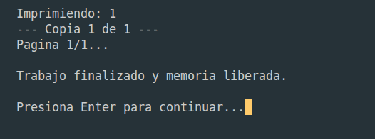
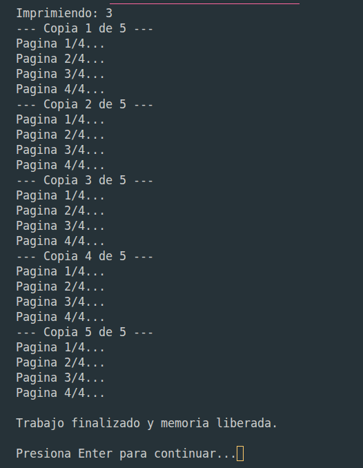

+++
date = '2026-03-13T20:22:41-07:00'
draft = false
title = 'Práctica 1: Elementos básicos de los lenguajes de programación'
+++

## INTRODUCCIÓN

### ¿QUÉ PROBLEMA SE RESOLVIO?
La creacion de un sistema para simular una impresora en lenguaje c con formato de cola
con memoria estatica y memoria dinamica

### ¿POR QUÉ UNA COLA?
Ya que utiliza el principio de FIFO y asi la primera entrada es la que se mandara a imprimir

## DISEÑO

### DEFINICION
PrintJob_t: Se definió un tipo de dato struct para la información de cada trabajo (Id, nombre_archivo, total_paginas y paginas_restantes).

### CAMPOS
int Id: Llave unica del nodo.

char nombre_Documento[48]: Almacena el nombre del archivo. Se definió con un tamaño fijo para evitar complicaciones.

int total_pages: Sirve para calcular porcentajes de avance.

int pages_remaining: Actúa como un contador regresivo.
En cada iteración del ciclo de impresión este valor se decrementa. La condicion de impresion depende de que este dato llegue a 0.

Status_t status:
PENDING: El trabajo está en la cola pero no ha llegado al frente.

PRINTING: El trabajo está en el frente de la cola y está siendo procesado actualmente.

COMPLETED: Estado que activa la función free() para eliminar el nodo y liberar la memoria una vez que pages_remaining llega a cero.

### DESCRIPCIÓN COLA (ESTATICA/DINAMICA):
Cola Estática:
En este modelo, la memoria se reserva en base al espacio que le des al momento de declararse.

front: Es el índice que apunta a la posición del primer elemento, al realizar un dequeue, este índice avanza.

rear: Es el índice que apunta a la última posición ocupada o a la siguiente posición disponible, al realizar un enqueue, este índice se desplaza.

size: Variable entera que registra la cantidad actual de elementos.

Cola Dinámica:

En este modelo, la memoria se aparta y crea mediante malloc. Los nodos se unen mediante punteros o referencias.

head: Es un puntero de tipo Node_t que apunta a la dirección de memoria del primer nodo.

tail: Es un puntero que referencia al último nodo de la lista enlazada., sin un puntero tail el programa tendría que recorrer toda la lista desde el head cada vez que llega un nuevo trabajo.

## IMPLEMENTACIÓN

### FUNCIONES
createJob(int id, char* name, int pages):
Reserva memoria para un nuevo PrintJob_t, inicializa los campos y, establece pages_remaining igual a pages y el estado en PENDING.

enqueue(Queue_t* q, PrintJob_t* job):
Inserta el trabajo al final de la cola. En la versión dinámica, conecta el next del actual tail al nuevo nodo y actualiza el puntero tail.

dequeue(Queue_t* q):
Extrae el elemento al frente. Se encarga de desconectar el head, moverlo al siguiente nodo y liberar la memoria con free().

isEmpty(Queue_t* q):
Función de consulta que devuelve un 0 u 1. Evita intentar procesar datos cuando la cola no tiene elementos.

### DECISIONES
Cola Circular:
Para la implementación estática, se decidió usar el operador módulo %. Esto permite que cuando los índices front o rear llegan al final del arreglo, salten a la posición 0 si hay espacio, optimizando el uso del arreglo sin necesidad de mover todos los elementos.

Validación de Estados:
Se decidió que el dequeue no se ejecute automáticamente al terminar un trabajo, sino que sea validado por la función de simulación. Esto permite que el sistema pueda mostrar un mensaje de "Trabajo Finalizado" antes de que los datos desaparezcan de la memoria.

Uso de Memoria Dinámica:
La decisión más relevante fue incluir un puntero tail en la estructura de control, lo que garantiza que agregar un trabajo tome siempre el mismo tiempo.

## DEMOSTRACIÓN

### ALCANCE
La variable int i utilizada dentro de los bucles de impresión. Su alcance está restringido al cuerpo del ciclo y su duración termina al finalizar la función.

La variable Queue_t *q recibida en las funciones. Tiene un alcance local a la función, pero permite acceder a datos que fuera de ella.

El nodo creado con malloc(sizeof(Node_t)). Su alcance es global a través de punteros, y su duración depende de la llamada explícita a free().

### MEMORIA
Stack (Pila): Aquí residen las variables de control del main y los punteros de apoyo. Son gestionadas automáticamente por el compilador.

Heap (Montículo): Se utiliza en la versión dinámica para almacenar cada PrintJob_t. Se solicita memoria en la función enqueue mediante malloc.

La memoria se libera en la función dequeue. Si se perdiera el puntero head antes de llamar a free() se generaría una fuga de memoria dejando ese bloque inaccesible para el sistema operativo.

### SUBPROGRAMAS
Funciones como enqueue(Queue_t *q) reciben la dirección de memoria de la cola. Esto deja que los cambios ,como mover el head o  tail persistan después de que la función termine. Sin punteros, se pasaría una copia y la cola original nunca se actualizaría.

En las funciones con consts se indica al compilador que la función tiene permiso para leer los datos de la cola, pero tiene prohibido modificarlos. Esto evita errores accidentales de escritura.

### TIPOS DE DATOS
El uso de struct se justifica porque un trabajo de impresión no se puede representar con un solo valor, necesitábamos agrupar tipos distintos bajo un mismo identificador.

El uso de un enum para el estado del trabajo (PENDING, PRINTING, COMPLETED) permite trabajar con nombres en lugar de números para facilitar el código y asegura que la variable solo tome valores que ya estan definidos.

## SIMULACIÓN

### EXPLICACIÓN
El avance se hace mediante el campo pages_remaining de la estructura PrintJob_t. 
El sistema siempre actúa sobre el nodo apuntado por head.
Al iniciar, el estado cambia de PENDING a PRINTING.
En cada iteración del bucle principal, se resta una unidad a pages_remaining.
Cuando el contador llega a 0, el estado del trabajo se marca como COMPLETED, lo que llama a la función dequeue para liberar el nodo y pasar al siguiente archivo en la cola.

Para evitar que la simulación termine en milisegundos, se introdujo un retraso controlado:
3 segundos por pagina en cada copia.

## ANALISIS COMPARATIVO

### ESTATICA VS DINAMICA
En la cola estática, todo es mas cerrado ya que al definir un arreglo de por ejemplo de 50 espacios, el programa aparta ese lugar en el Stack desde que inicia. Es mas seguro porque no tienes que andar liberando memoria, pero es un desperdicio de espacio si no los utilizas todos. 
Además, si llega un usuario con 51 documentos, el programa crashea porque el arreglo no se puede estirar.

Con la cola dinámica usamos el Heap, que es un espacio libre donde vas pidiendo pedazos de memoria con malloc conforme llegan los trabajos. Lo malo es que si no haces el free(), la memoria se queda ahí volando y eso es un problema grave si dejas el programa prendido mucho tiempo.

Programar la cola estática fue más fácil al principio. 
Si no usas la lógica de cola circular, te acabas el arreglo súper rápido aunque haya espacios vacíos al principio.

Lo bueno de la dinámica es que para insertar un elemento siempre tardas lo mismo, porque no tienes que mover nada, solo conectas el puntero next al nuevo nodo.
## CONCLUSIONES

### LO APRENDIDO
Lo que aprendí con la practica de laboratorio 1 es que no hay una mejor que otra, sino que depende de lo que necesites. Si tienes poca memoria y sabes exactamente cuántos datos vas a recibir, usarias la estática. Pero si quieres un programa mas profesional que no sepas cuánta carga va a tener, usarias la dinamica. 
El reto más grande fue acostumbrarse a que en la dinámica nosotros somos los responsables de limpiar la memoria.

## REFERENCIAS

### FORMATO APA
-Deitel, P. J., & Deitel, H. M. (2016). C How to Program (8va ed.). Pearson Education.

-Kernighan, B. W., & Ritchie, D. M. (1988). The C Programming Language (2da ed.). Prentice Hall.

-Sedgewick, R., & Wayne, K. (2011). Algorithms (4ta ed.). Addison-Wesley Professional.

-Stroustrup, B. (2013). The C++ Programming Language (4ta ed.). Addison-Wesley.

## ENLACES

-[Github](https://github.com/gibran-leon-linux?tab=repositories "Github")

-[Pagina Hugo](https://gibran-leon-linux.github.io/Portafolio/ "Hugo")