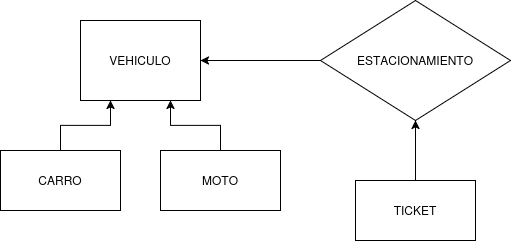
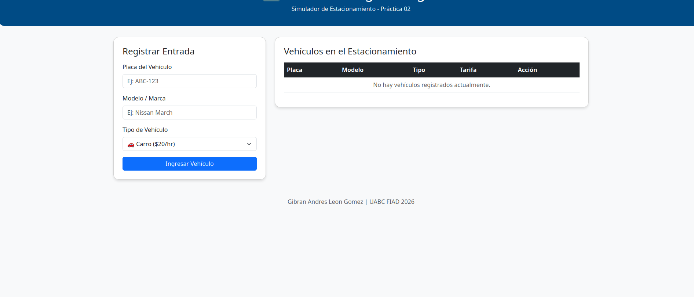
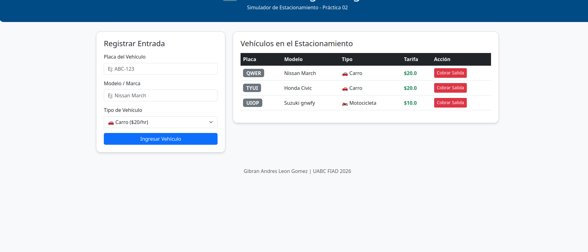

+++
date = '2026-04-03T23:54:00-07:00'
draft = true
title = 'Practica2'
+++

## INTRODUCCIÓN
El objetivo es el desarrollo de un Simulador de gestión de estacionamiento, un proyecto diseñado para aplicar Programación Orientada a Objetos. El programa permite el registro de entrada y salida de diferentes tipos de vehículos, calculando tarifas y gestionando la ocupación en tiempo real.
## OBJETIVOS
Diseñar e implementar un sistema de gestión de estacionamiento modular y funcional, integrando conceptos avanzados de POO y tecnologías web para resolver un problema de administración en tiempo real.

## MODELO DE DOMINIO

El sistema tiene una estructura en cuatro clases:
En la base de la se encuentra la clase Vehículo, la cual actúa como una abstracción general para definir los atributos como la placa y el modelo. De esta derivan las subclases Carro y Moto, que son las que implementan el poliformismo al definir sus propias tarifas de cobro y tipos de unidad.
La clase Estacionamiento tiene como responsabilidad gestionar los vehículos, controlar el limite y ver los procesos de entrada y salida. Y por ultimo la clase Ticket se encarga de los datos de cada estancia, encapsulando la información como el folio único y los tiempos de registro para garantizar datos correctos de los metodos de entrada y salida dentro del sistema.

## EVIDENCIA(POO)
3.1. ENCAPSULAMIENTO

    class Ticket:
        def __init__(self, placa):
            self.__folio = self._generar_folio()
            self.placa = placa

        def get_folio(self):
            return self.__folio

Explicación: Se utiliza el doble guion bajo para proteger el estado interno del objeto. Al hacerlo privado, no deja que sea modificado accidentalmente desde fuera de la clase.

3.2. ABSTRACCION

    class Vehiculo:
        def __init__(self, placa, modelo):
            self.placa = placa.upper()
            self.modelo = modelo
            self.tarifa = 0.0

Explicación: La clase Vehiculo actúa como una abstracción que captura las características de cualquier vehiculo (placa, modelo) sin entrar en detalles de implementación, sirviendo para las subclases.

3.3. COMPOSICION

    class Estacionamiento:
        def __init__(self, capacidad=10):
            self.capacidad = capacidad
            self.lugares_ocupados = {}

Explicación: Se aplica la composición mediante el uso de un estacionamiento. El Estacionamiento es el responsable de la existencia y gestión de estos objetos dentro de su ciclo de vida.

3.4. HERENCIA/SUBTIPOS

    class Carro(Vehiculo):
        def __init__(self, placa, modelo):
            super().__init__(placa, modelo)
            self.tipo = "Carro"
            self.tarifa = 20.0

Explicación: La clase Carro hereda de Vehiculo, reutilizando su lógica de inicialización mediante super() y expandiendo su funcionalidad con atributos como una tarifa de $20.0 o $10.0 para motos.

3.5. POLIMORFISMO

    <tr>
        <td>{{ v.placa }}</td>
        <td>{{ v.tipo }}</td>
        <td>${{ v.tarifa }}</td> </tr>

Explicación: Se observa el polimorfismo cuando el sistema recorre la lista de vehículos. Cada instancia responde con su propio valor de tarifa $20 para carros o $10 para motos de manera dinámica.
            

## MVC FLASK
### CAMPOS
(modelo.py): Contiene la lógica ya que aquí se encuentran las clases Vehiculo, Carro, Moto y Estacionamiento. Su única función es gestionar los datos, las tarifas y las reglas del estacionamiento.

(templates/index.html): Es la interfaz de usuario. Su responsabilidad es presentar la información al usuario de forma clara y recibir las interacciones.

(app.py): Define las rutas de Flask, recibe las peticiones del usuario al registrar un carro e invoca los métodos correspondientes en el Modelo y finalmente decide qué Vista mostrar como respuesta.

En el archivo app.py, se configuraron las siguientes rutas fundamentales:

    @app.route('/'): Carga la página principal y envía el almacenamiento de vehículos actual.

    @app.route('/entrada'): Procesa el formulario, crea la instancia del vehículo y la guarda.

    @app.route('/salida/<placa>'): Recibe el parámetro de la placa para eliminar el vehículo del sistema y liberar el espacio.

### CAPTURAS

## PRUEBAS MANUALES(2)
Flujo 1: Registro y Validación de Tarifa (Carro)

    1.- Se ingresó un vehículo con placa 123, modelo Nissan March y tipo Carro.

    2.- El sistema debe calcular una tarifa de $20.0 y mostrarlo en la tabla principal.

    3.- El controlador procesó la petición exitosamente y la vista renderizó el nuevo objeto con el icono de carro y la tarifa correcta.

Flujo 2: Registro de Moto y Liberación de Espacio

    1.- Se registró una unidad con placa 456 tipo Moto y posteriormente se presionó el botón Cobrar Salida.

    2.- La tarifa inicial debe ser de $10.0. Al cobrar, el vehículo debe eliminarse del almacenamiento del Modelo y desaparecer de el sistema.

    3.- El sistema aplicó el polimorfismo en el cobro y actualizó el estado del estacionamiento en tiempo real, dejando la tabla limpia.

## CONCLUSIONES
Esta práctica permitió una comprensión profunda de cómo la Programación Orientada a Objetos en python se traslada de un entorno teórico a una aplicación funcional. Al crear una arquitectura Web con flask se demostro que una separación clara de responsabilidades facilita el mantenimiento y la escalabilidad del software.

Este proyecto refuerza la capacidad de modelar problemas complejos mediante abstracciones y de utilizar herramientas modernas como entornos virtuales para entregar software de calidad.

## REFERENCIAS 
Pallets Projects. (2026). Flask Documentation (3.0.x). Recuperado de https://flask.palletsprojects.com/

Python Software Foundation. (2026). Python 3.12.3 documentation. Recuperado de https://docs.python.org/3/

## ENLACES

-[Github](https://github.com/gibran-leon-linux?tab=repositories "Github")

-[Pagina Hugo](https://gibran-leon-linux.github.io/Portafolio/ "Hugo")